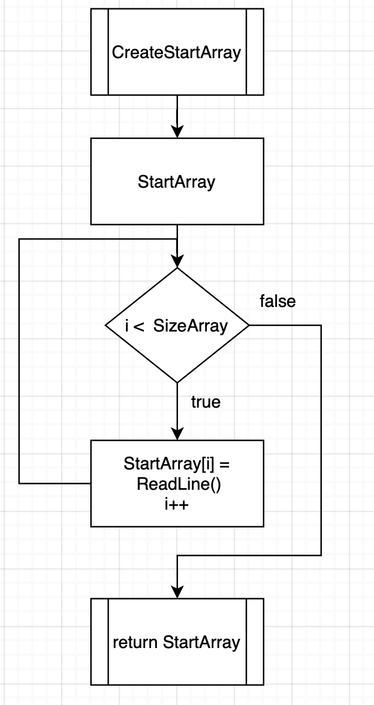
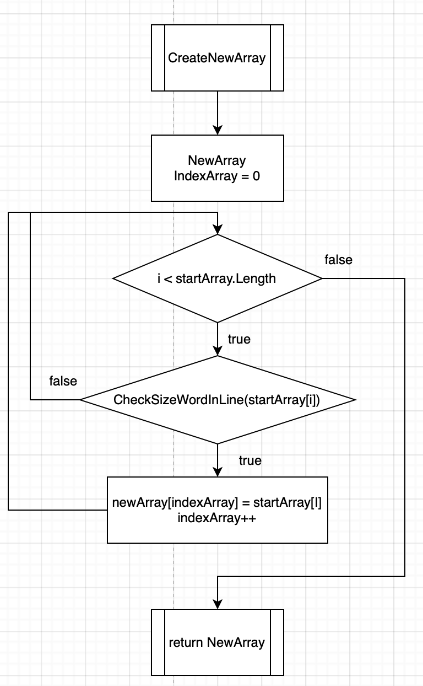

# Итоговая аттестация
## Шаг 1  - Создание массива

Для создания массива воспользуемся функцией - CreateStartArray. В качестве параметра будем передавать целочиселенное значение, отвечающее за размер массива.
Блок схема для этой функции будет выглядеть следующим образом.

Чтобы заполнить массива словами, воспользуемся обычным циклом for.

## Шаг 2 - Подсчет слов, которые удовлетворяют начальным критерями

Необходимо посчитать сколько всего слов в массиве удовлетворяют начальным требованиям, чтобы можно было создать новый массив с этим количество элементов. Для этого создана функция - CheckSizeNewArray

Для подсчета слов использовался цикл for, чтобы перемещаться по элементам массива. А для проверки длины слова использовался оператор if

## Шаг 3 - Создание нового массива

Для того, чтобы создать ноывй массив, воспользуемся функцией. В качестве параметров, будем передавать изначальный массив и целочисленное значение, которое было найдено на втором шаге.

Чтобы переносить только те слова, которые нам подходят, будем проверять каждое на количество символов. После того, как подходящее слово найдено, перенесем его в новый массив и увелчими индекс для нового массива, чтобы с помощью этого индекса можно было записать следующее слово.

Для проверки слова, воспользуемся отдельное булевой функцией, которая будет возвращать только true или false.

Алгоритм для этой функции выглядит следующим образом:

