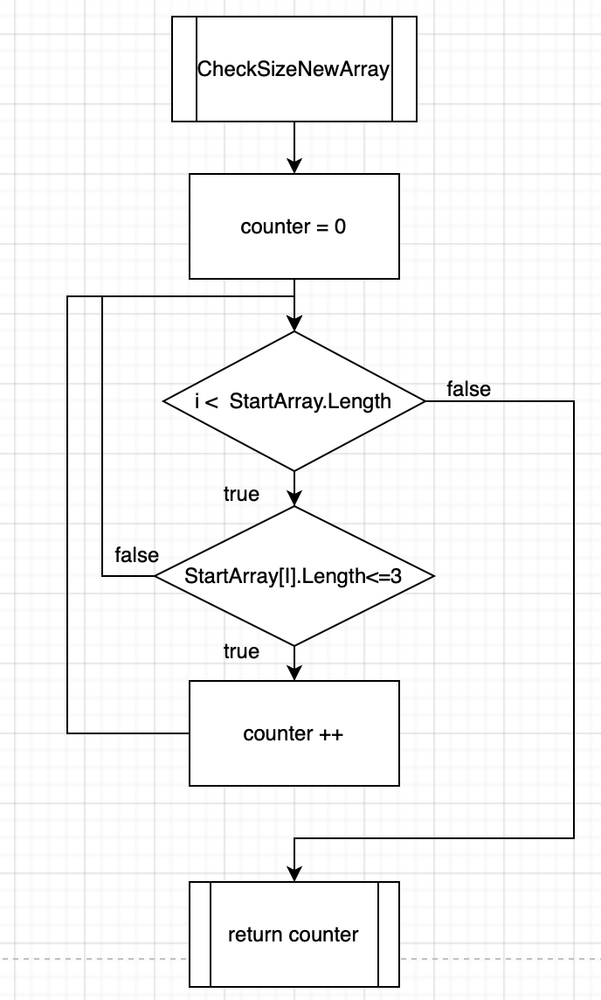

# Итоговая аттестация
## Шаг 1  - Создание массива

Для создания массива воспользуемся функцией - CreateStartArray. В качестве параметра будем передавать целочиселенное значение, отвечающее за размер массива.
Блок схема для этой функции будет выглядеть следующим образом.

Чтобы заполнить массива словами, воспользуемся обычным циклом for.

## Шаг 2 - Подсчет слов, которые удовлетворяют начальным критерями

Необходимо посчитать сколько всего слов в массиве удовлетворяют начальным требованиям, чтобы можно было создать новый массив с этим количество элементов. Для этого создана функция - CheckSizeNewArray

Для подсчета слов использовался цикл for, чтобы перемещаться по элементам массива. А для проверки длины слова использовался оператор if

